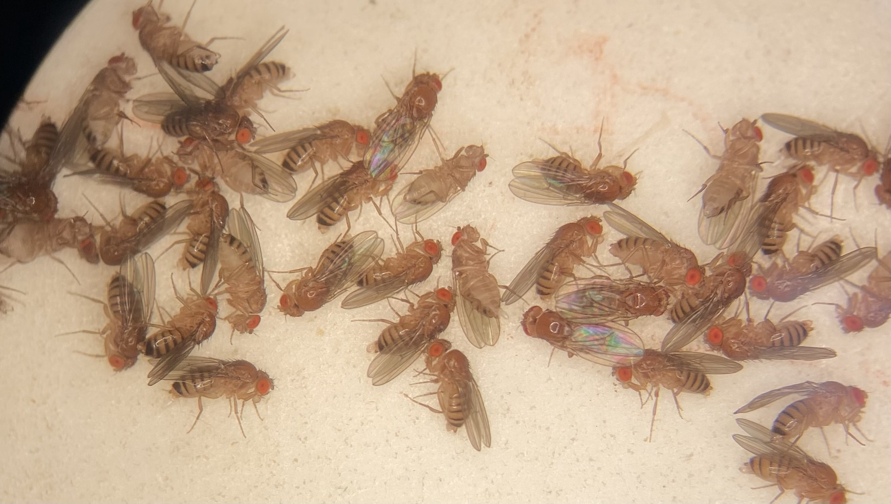

<!-- 

  

 -->

## Hello :)

I am a 4th year PhD Candidate in the Department of Ecology and Evolutionary Biology at the University of Toronto. I am supervised by [Dr. Aneil Agrawal](https://agrawal.eeb.utoronto.ca/). 

My current work focuses on understanding how sex-specific selection shapes within and across species variation in expression traits (i.e., differential gene expression levels and alternative splicing). To do this, I use experimental evolution and comparative transcriptomics. Beyond my work on expression, I am also interested more generally in the evolution of sexual dimorphism in higher-level traits (e.g., wing shape in *Drosophila*, body size and shape, behaviour, etc.) and in the genome itself (i.e., sex chromosomes). 

I grew up in the sweltering, bustling city of Jakarta before moving to Peterborough, ON, to complete my undergraduate degree in forensic science at Trent University. After deciding against my childhood dreams of fighting crime, I set out to complete an honours thesis on evolutionary ecology under the co-supervision of [Dr. Marcel Dorken](https://madorken.github.io/DorkenLab_Trent/index.html) and [Dr. Joanna Freeland](https://scholar.google.com/citations?user=zrCTcugAAAAJ&hl=en). In this work, I cultivated genetic markers for studying the evolution of mating systems in *Arabidopsis lyrata*, as well as a continuing interest in the evolution and consequences of sex.

I am always happy to chat! Shoot me an [email](mailto:mchelle.liu@mail.utoronto.ca) or check out my CV [here]().  

 
