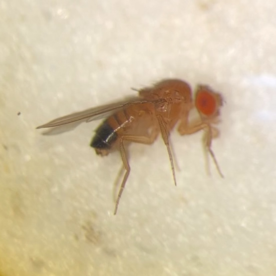
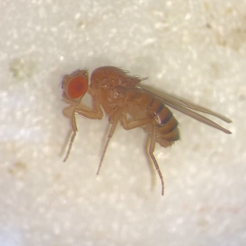
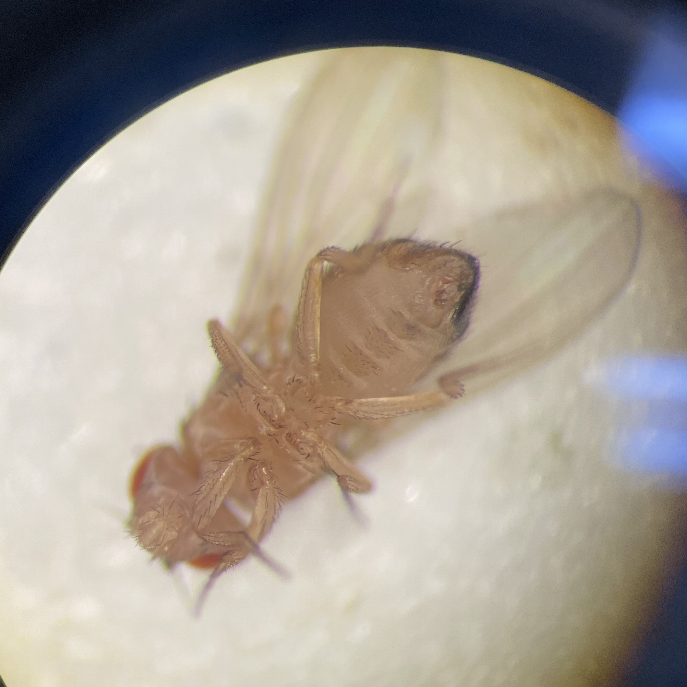
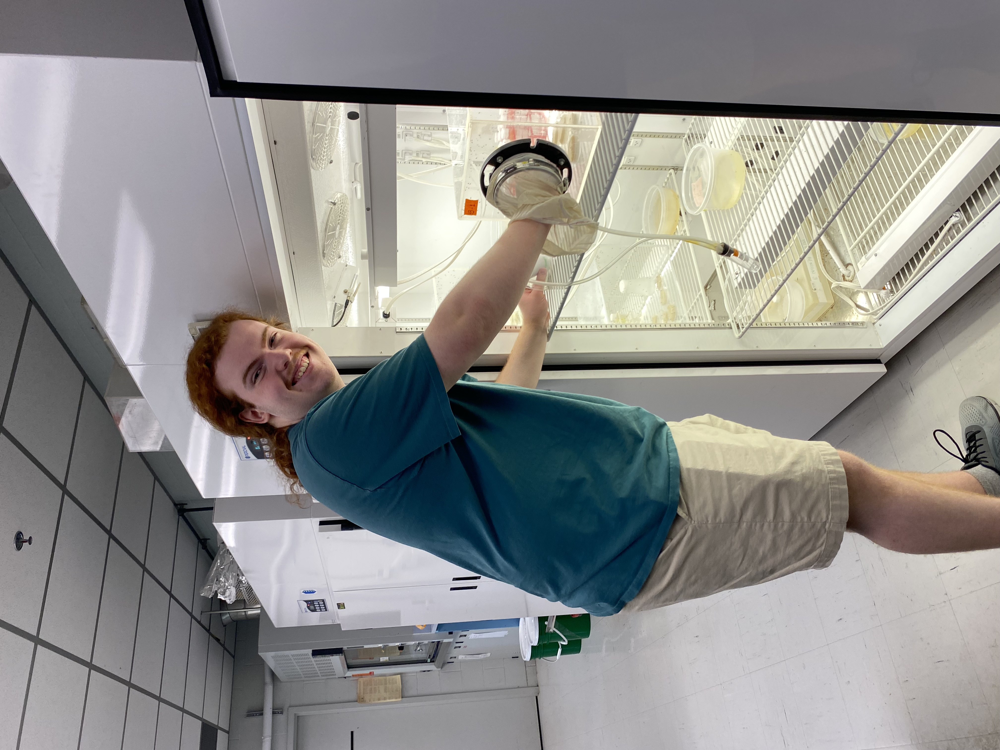
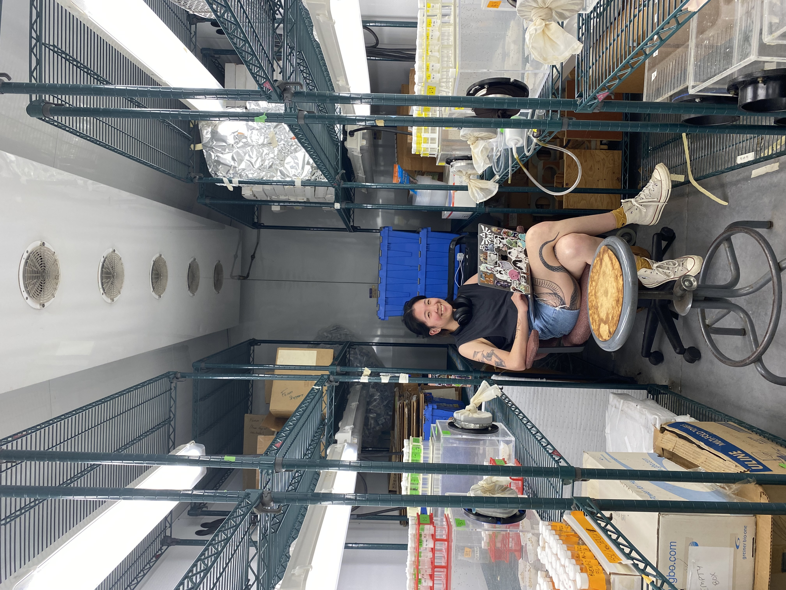
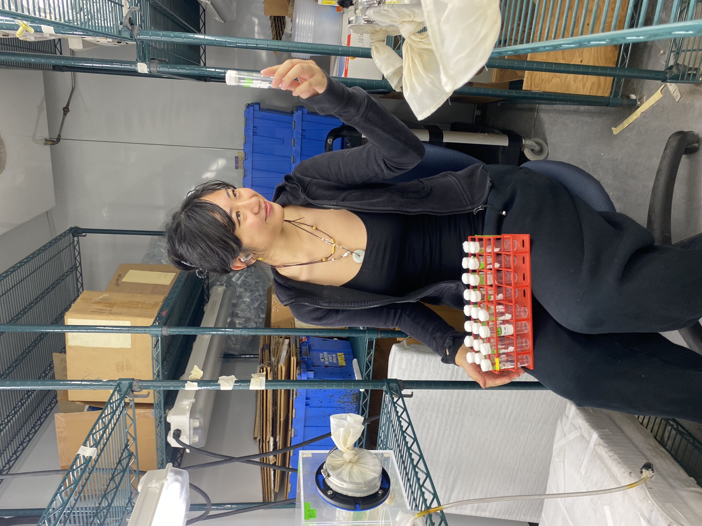

## **documented shenanigans**

#### A strange fly in the Sex-Limited Selection experimental population

  <figure style="text-align: center; margin: 0;">
    
    <figcaption style="font-style: italic; color: #555;">Is it a male?</figcaption>
  </figure>
  <figure style="text-align: center; margin: 0;">
    
    <figcaption style="font-style: italic; color: #555;">Is it a female?</figcaption>
  </figure>

  <figure style="text-align: center; margin: 0;">
    
    <figcaption style="font-style: italic; color: #555;">Is it both??</figcaption>
      </figure>

 

 

#### Mating success assays (a.k.a. staring at flies for 8 hours straight)
My amazing undergrads, Stephen Ottewell (left) and Samantha Wang (right), helping me maintain my sanity in the darkest of times.

  <figure style="text-align: center; margin: 0;">
    
  </figure>
  <figure style="text-align: center; margin: 0;">
    
  </figure>
   <figure style="text-align: center; margin: 0;">
    
  </figure>

 

 

#### Aneil Agrawal under a bridge

  <figure style="text-align: center; margin: 0;">
    
    <figcaption style="font-style: italic; color: #555;">Brought to knees by frog</figcaption>
  </figure>

